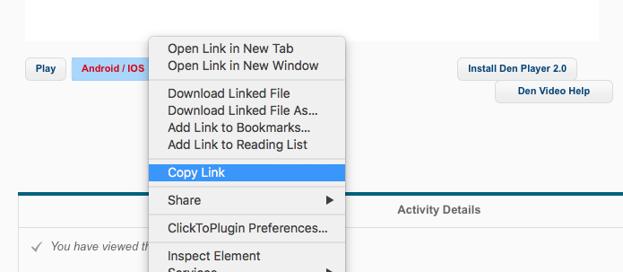

# DEN Video Downloader

Download USC DEN lecture videos beyond limitations.

* `.ts` file format with H.264 and AAC coded.
* No expiration dates.
* No DEN Player needed.
* No anything but the lecture videos.

### Pre-requisites

* macOS/Linux (tested OK on macOS 10.11/10.12 and Ubuntu 14.04)
* Python 3 (Install on [macOS](https://docs.python.org/3/using/mac.html)/[Ubuntu](http://askubuntu.com/questions/682869/how-do-i-install-newer-python-versions-using-apt-get))

### Usage

* Log into USC DEN.
* Open any lecture video.
* Copy the link of `Andoid / iOS` button.

* Open terminal and `cd` into the directory contains the script.
* Run with command:
    ```
    python3 ./dendown.py [url_copied_from_the_webpage]
    ```
* Wait the download process to complete.

### Acknowledgements

This script is only for convenience of downloading lecture videos only. The author is not responsible for the use and its subsequence.

License: [MIT License](./LICENSE)